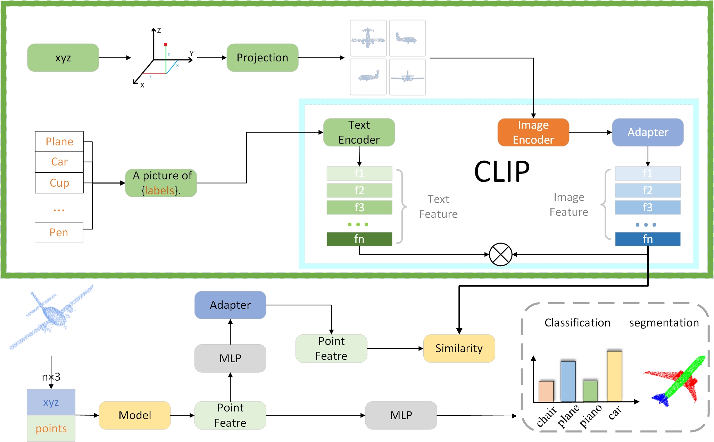

# Multimodal Contrastive Learning for 3D Object Classification and Part-segmentation by Leveraging V-LLM and CNNs

## Introduction

This is a release of the code of our paper ultimodal ***Contrastive Learning for 3D Object Classification and Part-segmentation by Leveraging V-LLM and CNNs***.

## Environment:
- PyTorch 1.10
- python 3.10
- RTX4090

        pip install -r requirements.txt

## Prepare the data
- Dataset: [ModelNet40](https://modelnet.cs.princeton.edu/), download it from [Official Site](https://shapenet.cs.stanford.edu/media/modelnet40_normal_resampled.zip) .
- Dataset: [ShapeNet part](https://shapenet.cs.stanford.edu/iccv17/#dataset), download it from [Official Site](https://shapenet.cs.stanford.edu/media/shapenetcore_partanno_segmentation_benchmark_v0_normal.zip).
- Dataset: [ScanObjectNN](http://103.24.77.34/scanobjectnn/h5_files.zip), download it from [Official Site](http://103.24.77.34/scanobjectnn/h5_files.zip).

## Run Code
        #Classification
        python train_clss.py
        
        #Part-segmentation
        train_part_seg.py

